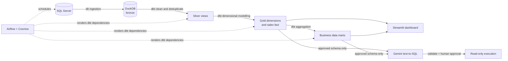

# E-commerce Analytics Platform

An end-to-end data engineering and analytics project that moves e-commerce
data from SQL Server into a tested medallion architecture, serves business
metrics through an interactive dashboard, and lets users ask governed
natural-language questions with Gemini.

I built this project to demonstrate more than a collection of SQL queries. The
goal was to design a small but complete analytics platform in which ingestion,
data modelling, orchestration, visualization, and AI-assisted querying work
together and remain understandable to future maintainers.

## What this project demonstrates

- Building a reproducible ELT pipeline from SQL Server to DuckDB with dlt
- Designing bronze, silver, and gold layers with clear responsibilities
- Modelling a dimensional warehouse and business-facing data marts with dbt
- Defining data-quality tests alongside transformation logic
- Orchestrating ingestion and dbt dependencies with Airflow and Cosmos
- Creating interactive analytics with Streamlit and Plotly
- Constraining LLM-generated SQL before it reaches the database
- Managing configuration and secrets through environment variables

## Architecture



The pipeline uses one DuckDB file for all analytical layers. This keeps the
project inexpensive and easy to run locally while still demonstrating the
same separation of concerns used in a larger warehouse.

## How the project evolved

### 1. Reliable ingestion

The first stage uses dlt to extract four source tables—customers, sales,
products, and regions—from SQL Server. Connection details are supplied at
runtime, and the DuckDB destination is resolved to an absolute path so the
same code works from a terminal or an Airflow worker.

The current pipeline deliberately performs a full replacement of the bronze
tables. This favors repeatability for a portfolio-sized dataset; incremental
loading and change-data capture are natural production extensions.

### 2. A layered transformation model

I introduced dbt after ingestion so that cleaning and business logic would be
versioned, testable, and visible through lineage:

| Layer | Responsibility | Examples |
| --- | --- | --- |
| Bronze | Preserve data loaded from the source | `customer`, `ecom_sales`, `product`, `region` |
| Silver | Clean fields, standardize values, deduplicate records, derive reusable measures | `silver_sales`, `silver_customer` |
| Gold core | Provide conformed dimensions and a sales fact | `dim_customer`, `dim_product`, `dim_region`, `dim_date`, `fct_sales` |
| Gold marts | Aggregate metrics for specific analytical questions | daily/monthly sales, customer 360, product and regional performance |

An important modelling decision is that `fct_sales` remains at sales-line
grain. Keeping the fact table detailed preserves analytical flexibility.
Aggregations such as daily revenue, month-over-month growth, customer lifetime
value, and product performance belong in the marts, where their grain and
business meaning are explicit.

Aggregate profit margin is recalculated as:

```text
SUM(profit) / NULLIF(SUM(revenue), 0)
```

This avoids the common mistake of averaging row-level percentages. Discounts
are similarly represented as revenue-weighted averages in aggregate marts.

### 3. Data quality as part of the model

The dbt project checks required identifiers, accepted values, uniqueness,
relationships, and invalid sales values. Tests run with the model graph so a
failed quality rule prevents downstream data products from being treated as
successful.

### 4. Business-facing analytics

The Streamlit dashboard turns the gold layer into an interactive product. It
supports date, product category, market, and customer segment filters and
surfaces:

- Revenue, profit, margin, orders, customers, and profitable-sales rate
- Monthly revenue and profit trends
- Sale-quality and discount analysis
- Product revenue versus margin
- Regional performance

All dashboard queries use parameters and short-lived, read-only DuckDB
connections.

### 5. Governed text-to-SQL

The Gemini integration was designed with a narrow trust boundary. The model
receives only an allowlisted description of approved gold tables—not database
credentials, customer-level marts, or direct database access.

Generated SQL passes through several controls before execution:

1. Only one statement is accepted.
2. Only `SELECT` queries over approved gold relations are allowed.
3. Write operations, external file access, extensions, and unsafe functions
   are rejected.
4. Detail queries are limited to 100 rows.
5. A person must review and approve the generated SQL.
6. The final query runs through a read-only connection with external access
   disabled.

This does not treat an LLM as a trusted database client; it treats the model as
a query-writing assistant behind deterministic controls.

### 6. Orchestration

Airflow schedules the complete batch workflow, and Astronomer Cosmos converts
the dbt dependency graph into individual Airflow tasks. The resulting DAG is:

```text
ingest_bronze → silver models/tests → gold core models/tests → marts/tests
```

DuckDB is an embedded database and is not intended for concurrent writes from
separate processes. The DAG therefore uses a single-slot `duckdb_writer` pool,
one active task, and one active run. This is an explicit reliability tradeoff;
a production warehouse could safely restore parallel model execution.

## Technology stack

| Area | Technology |
| --- | --- |
| Source | Microsoft SQL Server |
| Ingestion | dlt, SQLAlchemy, pyodbc |
| Analytical database | DuckDB |
| Transformation and testing | dbt Core, dbt-duckdb |
| Orchestration | Apache Airflow, Astronomer Cosmos, Docker Compose |
| Dashboard | Streamlit, Plotly, pandas |
| Text-to-SQL | Google Gemini, Pydantic, SQLGlot |
| Environment and packaging | Python 3.13, uv |

## Repository structure

```text
.
├── ingestion/          # SQL Server → DuckDB bronze ingestion
├── transformation/     # dbt silver, gold core, marts, and tests
├── orchestration/      # Airflow/Cosmos DAG and Docker deployment
├── dashboard/          # Streamlit analytics and Ask Data page
├── text_to_sql/        # Gemini generation, validation, and execution
├── .env.example        # Publishable configuration template
├── pyproject.toml      # Application dependencies
└── uv.lock             # Reproducible dependency lock
```

## Run locally

### Prerequisites

- Python 3.13
- [uv](https://docs.astral.sh/uv/)
- Microsoft ODBC Driver 18 for SQL Server
- Access to the source SQL Server
- A Gemini API key only if using text-to-SQL
- Docker and Docker Compose only if using Airflow

### 1. Install dependencies

```bash
git clone https://github.com/1stEsper/text2SQL_Ecommerce.git
cd text2SQL_Ecommerce
uv sync
```

### 2. Configure the environment

```bash
cp .env.example .env
```

Complete the required SQL Server variables in `.env`. Set
`T2S_DUCKDB_PATH` to an absolute path on your machine. Add `GEMINI_API_KEY`
only when using the natural-language query feature. The `.env` file and local
database files are excluded from Git.

### 3. Load the bronze layer

```bash
uv run python ingestion/ingest.py
```

### 4. Build and test the warehouse

```bash
uv run dbt build \
  --project-dir transformation \
  --profiles-dir transformation
```

### 5. Start the dashboard

```bash
uv run streamlit run dashboard/app.py
```

Open <http://localhost:8501>. The main page uses deterministic analytics; the
**Ask Data** page additionally requires Gemini.

### 6. Ask a question from the command line

```bash
uv run python -m text_to_sql.cli \
  "What were monthly revenue and profit in 2023?"
```

The CLI shows the generated SQL and asks for approval before executing it.

## Run with Airflow and Cosmos

```bash
export AIRFLOW_UID="$(id -u)"
docker compose -f orchestration/docker-compose.yml build
docker compose -f orchestration/docker-compose.yml up airflow-init
docker compose -f orchestration/docker-compose.yml up -d
```

Open <http://localhost:8080>, enable `ecommerce_medallion_pipeline`, and trigger
the DAG. Detailed operational instructions are available in
[`orchestration/README.md`](orchestration/README.md).

Stop the services with:

```bash
docker compose -f orchestration/docker-compose.yml down
```

## Tests

Run the Python safety tests:

```bash
uv run python -m unittest discover -s text_to_sql/tests -v
```

Run all dbt models and data tests:

```bash
uv run dbt build \
  --project-dir transformation \
  --profiles-dir transformation
```

The text-to-SQL test suite covers allowlisted relations, CTEs, row limits,
multiple statements, writes, unqualified tables, bronze access, and external
file functions.

## Current limitations and next steps

- Replace full-refresh ingestion with incremental loading and audit columns.
- Move from a local DuckDB file to a multi-user warehouse for parallelism and
  deployment at scale.
- Add source freshness checks, observability, and failure notifications.
- Add CI to run Python and dbt checks for every pull request.
- Evaluate text-to-SQL quality against a versioned set of business questions.
- Deploy the dashboard and Airflow environment separately with managed secrets.

## Why I built it this way

The central idea is that trustworthy analytics requires clear boundaries:
ingestion should not contain business logic, cleaned records should not be
confused with business metrics, aggregate marts should declare their grain,
and an LLM should never bypass deterministic security controls. The project is
small enough to run on a laptop, but its components and tradeoffs mirror the
design questions found in production data platforms.
